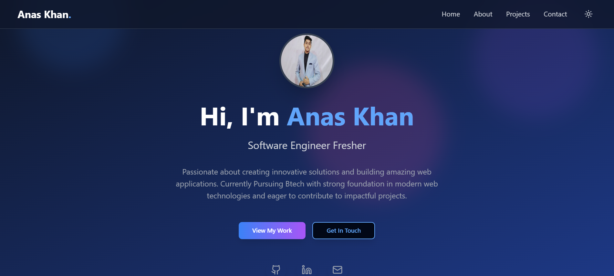

# 🌐 My Portfolio  

A sleek and interactive **developer portfolio website** showcasing my skills, projects, and achievements.  
Built with modern technologies for **performance, animations, and a great user experience**.  

 

---

## 🛠️ Tech Stack  

- ⚡ [Vite](https://vitejs.dev/) – Lightning-fast bundler & dev server  
- ⚛️ [React](https://react.dev/) – Component-driven UI  
- 📘 [TypeScript](https://www.typescriptlang.org/) – Strong typing for maintainable code  
- 🎨 [Tailwind CSS](https://tailwindcss.com/) – Utility-first styling  
- 🧩 [shadcn/ui](https://ui.shadcn.com/) – Beautiful & accessible UI components  
- 🎬 [GSAP](https://gsap.com/) – High-performance animations with **ScrollTrigger**  
- 🌗 Dark Mode – Auto + manual toggle for seamless theme switching  

---

## ✨ Features  

- 🌟 **Modern UI/UX** – Clean, elegant, and intuitive design  
- 📱 **Responsive Layout** – Optimized for desktop, tablet, and mobile  
- 🌗 **Dark Mode Support** – Smooth theme switching  
- 🎬 **Scroll Animations** – Engaging GSAP-powered effects with `ScrollTrigger`  
- 📂 **Project Showcase** – Highlighting best projects with links & descriptions  
- 📄 **Resume & Contact Section** – Easy ways to connect  

---
